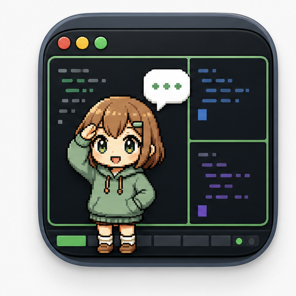

<p align="center">
  
</p>

# TmuxPal

macOS native overlay daemon for tmux-based coding AI sessions. It runs
separately from Codex.app, watches tmux panes for Codex, Claude Code, GitHub
Copilot CLI, and opencode, then shows Dokochan with stacked status bubbles.

## Features

- Floating AppKit overlay with bundled Dokochan assets.
- Detects all AI panes in tmux, not just the active pane.
- Shows `tool · repo/window · status · short title` bubbles.
- Drag the pal to move it; the position is saved in `UserDefaults`.
- Dragging switches Dokochan to running animations.
- Bubble click focuses the matching tmux pane.
- Menu bar app only: no Dock icon and no settings window.
- Select a custom pal from the menu bar by choosing a folder that contains
  `pal.json`.
- Select pal size from the menu bar. The current display size is `Small`; `Medium`
  and `Large` scale the pal while preserving its screen position.
- Screenshot mode is available from the menu bar. It swaps in sanitized demo
  bubbles and can export a transparent PNG set with bubbles and pal-only
  variants for `Small`, `Medium`, and `Large`.
- Toggle "Launch at Login" from the menu bar.
- tmux hooks append lifecycle events to:
  `~/Library/Application Support/tmuxpal/events.jsonl`.
- Optional `codex app-server` support is available by launching with
  `TMUXPAL_ENABLE_APP_SERVER=1`.

## Supported Harnesses

TmuxPal detects these AI coding TUIs when they are running inside tmux panes:

- Codex CLI: `codex`, including node-backed `bin/codex` launchers.
- Claude Code: `claude` command, process arguments, or pane titles.
- GitHub Copilot CLI: `copilot` command, process arguments, or pane titles.
- opencode: `opencode` command, process arguments, or pane titles.

Detection combines tmux pane metadata, current command, process arguments, and
pane titles. Polling works without hooks; hooks only improve lifecycle timing
when installed manually.

## Build And Run

Build locally from source:

```bash
SWIFTPM_DISABLE_SANDBOX=1 swift test --disable-sandbox
./Scripts/build_app.sh
open ./dist/TmuxPal.app
```

The app does not require `TMUX_PANE`; it polls the whole tmux server.

## Install From GitHub Release

Download either `TmuxPal-<version>.dmg` or `TmuxPal-<version>.zip` from a
GitHub Release, then move `TmuxPal.app` to `/Applications` and open it once.

Release artifacts are Developer ID signed and notarized when these GitHub
Actions secrets are configured:

- `CODESIGN_IDENTITY`
- `APPLE_DEVELOPER_ID_CERTIFICATE_BASE64`
- `APPLE_DEVELOPER_ID_CERTIFICATE_PASSWORD`
- `APPLE_ID`
- `APPLE_TEAM_ID`
- `APPLE_APP_SPECIFIC_PASSWORD`
- `KEYCHAIN_PASSWORD` (optional)

Without those secrets, local and CI builds fall back to ad-hoc signing and
macOS Gatekeeper will block the downloaded app.

For a temporary local install from a non-notarized release, move the app to
`/Applications`, remove the download quarantine attribute, then ad-hoc sign it
on your Mac:

```bash
xattr -dr com.apple.quarantine /Applications/TmuxPal.app
codesign --force --deep --sign - /Applications/TmuxPal.app
open /Applications/TmuxPal.app
```

This only trusts the app on your Mac. Public distribution still requires
Developer ID signing and notarization.

Create a release by pushing a version tag:

```bash
git tag v0.1.0
git push origin v0.1.0
```

GitHub Actions runs tests, builds the app, creates a zip, creates a dmg, writes
SHA-256 checksums, and attaches all files to the GitHub Release.

## LaunchAgent

Install as a per-user LaunchAgent:

```bash
./Scripts/install-launch-agent.sh
```

Remove it:

```bash
./Scripts/uninstall-launch-agent.sh
```

This must be a LaunchAgent, not a LaunchDaemon, because the overlay needs the
logged-in Aqua GUI session.

## tmux Hooks

TmuxPal works without hooks by polling tmux. Install hooks manually if you want
faster lifecycle event updates:

```bash
./Scripts/install-tmux-hooks.sh
```

Remove them:

```bash
./Scripts/uninstall-tmux-hooks.sh
```

The installer only uses hook slot `900` for:

- `after-new-window`
- `after-split-window`
- `after-select-window`
- `after-select-pane`
- `pane-exited`
- `pane-died`

It does not overwrite other hook slots.
The same slot is unset before it is set, so repeated installs are idempotent and
do not duplicate hooks.

## Pal Assets

Default assets:

- bundled `Characters/dokochan/spritesheet.webp`
- bundled `Characters/dokochan/pal.json`

The menu bar lists pal directories found under `$HOME/.codex/tmuxpal/characters` when they
contain `pal.json`. If no characters are found there, the selector falls back to a
file picker. Relative `spritesheetPath` entries are resolved from the selected
pal directory.

## License

MIT.
